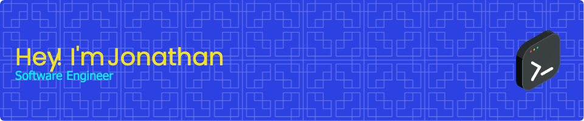

**<h3 align="center">Connect with me:</h3>** 

  

 **<h3 align="left">☀️ As I end my time learning (more than I could have imagined) in the School of Code's intensive full-stack bootcamp, I am ready to start my first role in tech.
I have a passion for combining analytical thinking with creative problem-solving. As a former teacher and musician, I enjoy learning from and tailoring my communication to those around me. Along with a methodical approach, I have a growing appreciation for secure and efficient code and I thrive in collaborative, innovative environments. I commit to immersing myself in up-to-date technologies and current best practices while honing my fundamentals.</h3>**

**<h3 align="left">Rapid Fire</h3>**

- 💼 I'm currently working on: **💻 Expanding my team's final project app <a href="https://food-waste-i3l25qcwx-lambric42s-projects.vercel.app/" target="_blank">Pantry Pal</a>**
- 🌱 I'm currently learning: **📚 Clean Code**
- 💬 Ask me about: **💡 JavaScript, React, Next.js, Node.js, Typescript, and RESTful APIs**
- ⚡ Fun fact: **🎸 I'm a former professional guitarist & music teacher 🛥️ I've performed & lived on cruise ships**

 **<h3 align="left">Skills</h3>**

           

 **<h3 align="left">GitHub Stats</h3>**

  
  

